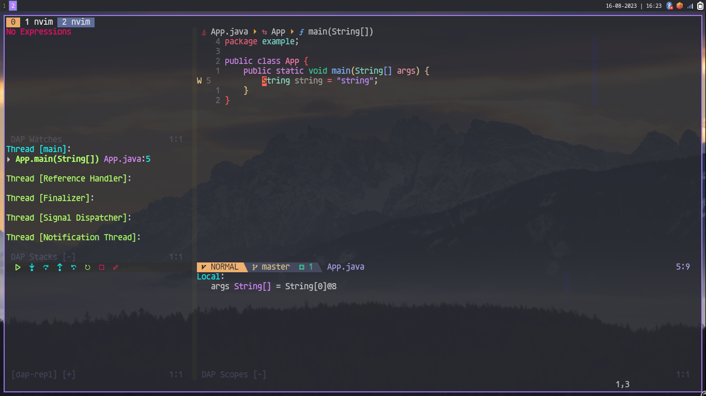

# Custom config

Simple java configuration, follow the instructions below :)

## jdtls

- Download [jdtls](https://download.eclipse.org/jdtls/milestones/?d) actual is 1.23
- Place whatever you want in your system and configure the paths in ftplugin/java.lua

## java-debug

- Clone [java-debug](https://github.com/microsoft/java-debug)
- `cd java-debug`
- `./mvnw clean install`

# vscode-java-test

- clone [vscode-java-test](https://github.com/microsoft/vscode-java-test)
- `cd vscode-java-test`
- `npm install`
- `npm run build-plugin`
